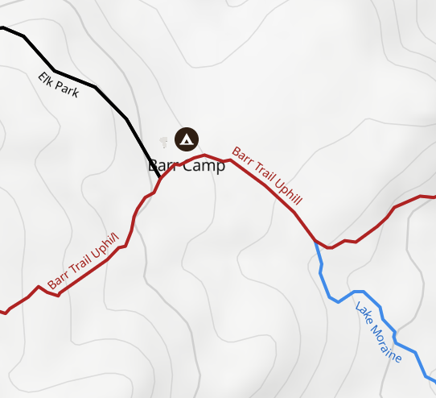
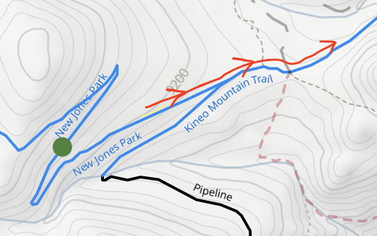
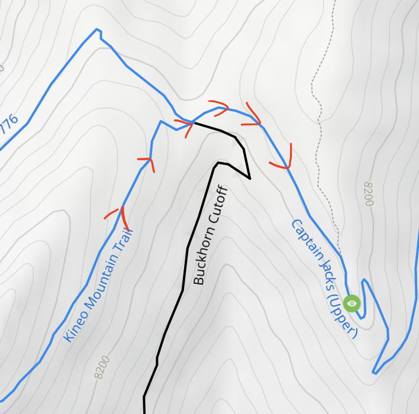

# MTB Self-Shuttle Plan: Elk Park → Jones Park → Captain Jacks
This is a plan for self-shuttling a partial pikes peak plummet, starting from Elk Park and ending on Captain Jacks.

## Summary
- **Starting Point Parking:** [Elk Park Trailhead](https://www.google.com/maps/place/38%C2%B052'37.9%22N+105%C2%B003'55.7%22W/@38.8765007,-105.0667217,257m/data=!3m1!1e3!4m4!3m3!8m2!3d38.877204!4d-105.065475?entry=ttu&g_ep=EgoyMDI1MDgxNy4wIKXMDSoASAFQAw%3D%3D) off Pikes Peak Highway
- **Ending Point Parking:** [**Ridgeway Ave Parking**](https://www.google.com/maps/place/Ridgeway+Ave+Parking/@38.795,-104.8613527,722m/data=!3m1!1e3!4m12!1m5!3m4!2zMzjCsDQ3JzQyLjAiTiAxMDTCsDUxJzMxLjYiVw!8m2!3d38.795!4d-104.8587778!3m5!1s0x87135b6cc3383ddb:0x86042487535dbdb2!8m2!3d38.7952001!4d-104.858472!16s%2Fg%2F11hdvlgcrh?entry=ttu&g_ep=EgoyMDI1MDgxNy4wIKXMDSoASAFQAw%3D%3D) in North Cheyenne Cañon Park
- [**Trailforks Route**](https://www.trailforks.com/ridelog/planner/view/622004/)
- [**gpx file**](./gpx/elk-park-to-cheyenne-canon.gpx)
### Stats
- Total Distance: ~23-25 miles
- Elevation Gain: ~913 ft
- Elevation Loss: ~6,900+ ft
- Ride Time: ~6–7 hrs moving (~8 hrs elapsed)
- Shuttle Time: ~70-75 minutes (one way)

### Trails
1. [Elk Park Trail (#652)](https://www.trailforks.com/trails/elk-park/)  
2. [Barr Trail](https://www.trailforks.com/trails/barr-trail-10571/)  
3. [Foresters Trail (#701)](https://www.trailforks.com/trails/foresters-trail-701/)  
4. [Jones Park Trail (#667)](https://www.trailforks.com/trails/jones-park-667/)  
5. [Captain Jacks (Trail #667)](https://www.trailforks.com/trails/captain-jacks-667/)  
6. [Captain Morgans](https://www.trailforks.com/trails/captain-morgans/)  
7. [Penrose](https://www.trailforks.com/trails/penrose/)  
8. [Ladders](https://www.trailforks.com/trails/ladders/)  
9. [The Chutes (#627)](https://www.trailforks.com/trails/chutes-627/)  
10. [Ridge (Stratton Open Space)](https://www.trailforks.com/trails/ridge-13683/)  
11. [Ridge South](https://www.trailforks.com/trails/ridge-south/)  

## 1. **Waypoints (Turn-by-Turn)**
Here’s a logical flow with checkpoints you can load into a GPS app (Trailforks, MTB Project, or Gaia GPS):

1. **Start: Elk Park Trailhead**  
   - Park car at [Elk Park Trailhead](https://www.google.com/maps/place/38%C2%B052'37.9%22N+105%C2%B003'55.7%22W/@38.8765007,-105.0667217,257m/data=!3m1!1e3!4m4!3m3!8m2!3d38.877204!4d-105.065475?entry=ttu&g_ep=EgoyMDI1MDgxNy4wIKXMDSoASAFQAw%3D%3D), ~11,800 ft (on Pikes Peak Highway, above Glen Cove).

2. [**Elk Park Trail (Trail #652)**](https://www.trailforks.com/trails/elk-park/)  
   - Descend ~5.2 miles, 1,600+ ft down. Expect creek crossings & rocky sections.

3. **Barr Trail Junction**
   - Turn **left (north)** briefly on Barr Trail near Barr Camp. Be mindful of hikers.  
   - Distance so far: ~6.5 mi / 1.5 hrs.
    

5. [**Lake Moraine/Forresters Trail (Trail #701)**](https://www.trailforks.com/trails/lake-moraine/)
   - Take connector from Barr → Lake Moraine → Foresters.  
   - Flow sections through meadowy terrain, mixed tech.
   - Make a ***left*** at the fork to Jones Park.

6. [**New Jones Park (Trail #667)**](https://www.trailforks.com/trails/new-jones-park/)  
   - Enter New Jones Park system. Rolling singletrack with forested climbs and tech features.  
   - Distance so far: ~15 mi / 3.5 hrs.
   - New Jones Park trail turns into Kineo Mountain trail; don't make any turns.
    

7. [**Kineo Mountain Trail → Captain Jacks (Trail #667/701)**](https://www.trailforks.com/trails/kineo-mountain-trail/)
   - Descend classic Captain Jacks. Flow, berms, rocky sections.  
   - Option: continue down **Chutes** for a spicy finish.  
   - Total distance: ~23–24 miles.
   - Kineo turns into Upper Captain Jacks; don't make any turns at the intersection.
      
8. [**Captain Jacks (Trail #667)**](https://www.trailforks.com/trails/captain-jacks-667/)
- Continue **straight** from Jones into **Upper Captain Jacks**.  
- Stay on Captain Jacks as it winds down (ignore side connectors).  
- After ~3.5 mi, the trail transitions into **Lower Captain Jacks** without needing to turn.  
- **At junction with Captain Morgans**: Turn **right** to exit Captain Jacks onto Morgans.  

9. [**Captain Morgans**](https://www.trailforks.com/trails/captain-morgans/)
- Flow trail branching off Jacks.  
- Stay on Morgans; it will naturally lead into Penrose.  
- No turns needed at the transition.  

10. [**Penrose**](https://www.trailforks.com/trails/penrose/)
- Follow Penrose straight through.  
- **At intersection with Ladders**: Turn **right** onto Ladders.  

11. [**Ladders**](https://www.trailforks.com/trails/ladders/)
- Steep, rocky descent.  
- Follow until it **dumps onto Gold Camp Road**.  
- Cross Gold Camp Road and head **straight across** to enter The Chutes.  

12. [**The Chutes (#627)**](https://www.trailforks.com/trails/chutes-627/)
- Stay in the **downhill-only lane**.  
- Descend ~1 mi to Stratton Open Space.  
- At bottom junction: Turn **left** onto the Ridge trail.  

13. [**Ridge (Stratton Open Space)**](https://www.trailforks.com/trails/ridge-13683/)
- Climb/roll along Ridge.  
- Stay on Ridge, ignoring side connectors to Meadows or Stratton Springs.  
- At the **southern end of Ridge**, trail continues directly into Ridge South.  

14. [Ridge South](https://www.trailforks.com/trails/ridge-south/)
- Continue straight from Ridge into Ridge South (no turn needed).  
- Rolling finish along the southern contour.  
- End the ride at Stratton Open Space exit at the [**Ridgeway Ave Parking**](https://www.google.com/maps/place/Ridgeway+Ave+Parking/@38.795,-104.8613527,722m/data=!3m1!1e3!4m12!1m5!3m4!2zMzjCsDQ3JzQyLjAiTiAxMDTCsDUxJzMxLjYiVw!8m2!3d38.795!4d-104.8587778!3m5!1s0x87135b6cc3383ddb:0x86042487535dbdb2!8m2!3d38.7952001!4d-104.858472!16s%2Fg%2F11hdvlgcrh?entry=ttu&g_ep=EgoyMDI1MDgxNy4wIKXMDSoASAFQAw%3D%3D) in North Cheyenne Cañon Park.  

# Ride Summary
- **Total Distance**: ~25–26 miles  
- **Elevation Gain**: ~1,200–1,300 ft  
- **Elevation Loss**: ~6,900+ ft  
- **Ride Time**: ~6–7 hrs moving (~8 hrs elapsed)  

Clear alpine-to-city descent with explicit navigation. Follow forks as marked:  
- **Stay Left** at Elk Park fork.  
- **Turn Left** Barr → Foresters.  
- **Turn Right** Jones → Captain Jacks.  
- **Turn Right** Jacks → Captain Morgans.  
- **Turn Right** Penrose → Ladders.  
- **Go Straight** across Gold Camp → Chutes.  
- **Turn Left** Chutes → Ridge.  
- **Go Straight** Ridge → Ridge South.
